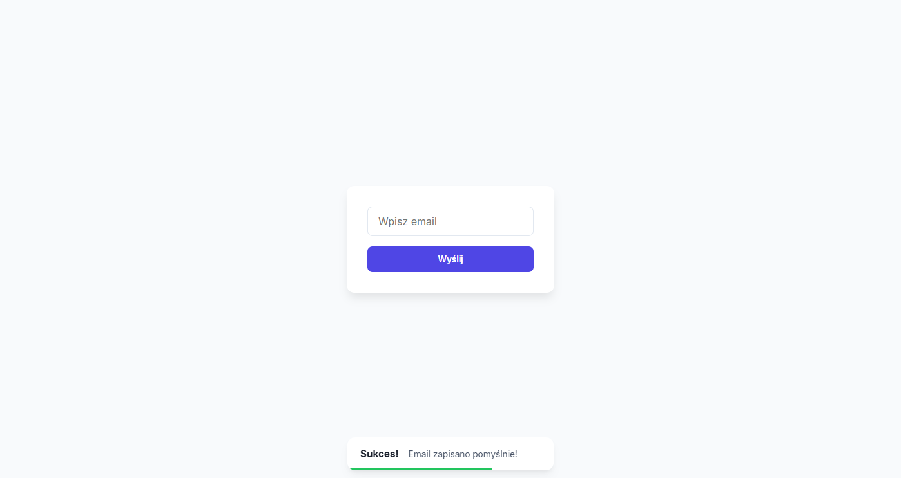
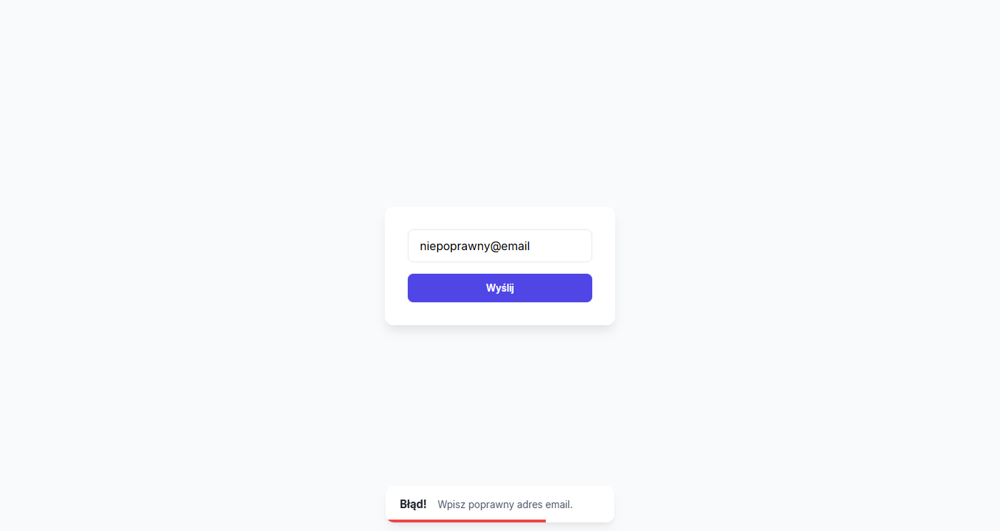

# Walidacja Formularza Newslettera

Komponent zapisu do newslettera, który dba o czystość bazy danych i wrażenia użytkownika. Aplikacja weryfikuje poprawność wprowadzonego adresu email w czasie rzeczywistym i komunikuje status operacji za pomocą dynamicznych powiadomień.

## Jak to działa?

Użytkownik wpisuje swój adres email w polu formularza. Podczas próby wysłania, skrypt sprawdza, czy pole nie jest puste oraz czy wpisany ciąg znaków jest poprawnym adresem email. System informuje o sukcesie lub błędzie poprzez powiadomienia typu "Toast", a sam przycisk wysyłania blokuje się na czas procesowania zapytania.

## Funkcje

- **Walidacja Email:** Sprawdzanie poprawności formatu za pomocą wyrażeń regularnych (Regex).
- **System Toastów:** Dynamiczne powiadomienia o statusie (sukces/błąd) z limitem do 3 komunikatów jednocześnie.
- **Obsługa stanów asynchronicznych:** Blokada przycisku "submit" oraz zmiana jego treści podczas symulowanej komunikacji z serwerem.
- **Feedback wizualny:** Powiadomienia typu Toast i paski postępu informujące o ich żywotności.
- **Responsywny design:** Formularz dopasowany do urządzeń mobilnych i desktopowych.

## Zobacz demo

### Podgląd działania

### Link do testu
[Demo walidacji formularza](https://rayskidev.github.io/email-validation/)

## Środowisko testowe

- Opera GX
- Microsoft Edge
- Firefox
- Google Chrome
